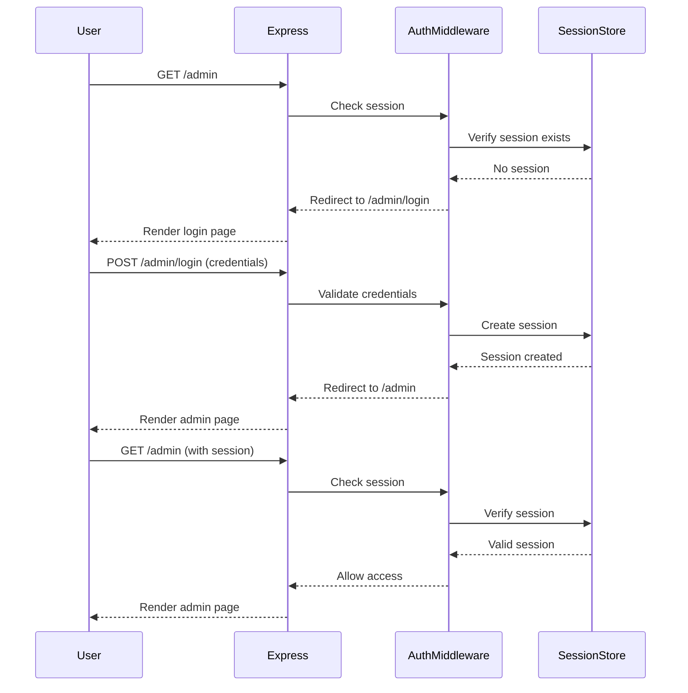

# Admin View Authentication Implementation Plan

## Overview

This document describes the detailed implementation plan for adding session-based authentication to protect the admin view (`/admin`) in the Matkaklubi application. The authentication system will use Express.js sessions with credentials stored in environment variables.

## Goals

- Protect the `/admin` route from unauthorized access
- Implement a login page for admin authentication
- Use session-based authentication for maintaining login state
- Store admin credentials securely in environment variables
- Provide logout functionality
- Maintain consistency with existing code structure and styling

## Architecture

### Authentication Flow



## Implementation Steps

### Step 1: Install Dependencies

**Action:** Install the `express-session` package

**Command:**
```bash
npm install express-session
```

**Details:**
- `express-session` provides session management middleware for Express
- This package will handle session creation, storage, and cookie management
- Version compatibility: Works with Express 5.x (current version in project)

### Step 2: Configure Session Middleware

**File:** `index.js`

**Changes:**
1. Import `express-session` at the top of the file
2. Configure session middleware before route definitions
3. Set up session options:
   - Secret from environment variable
   - Cookie settings (httpOnly, secure in production)
   - Session store (memory store for development)

**Code Structure:**
```javascript
import session from 'express-session'

// After app setup, before routes
app.use(session({
    secret: process.env.SESSION_SECRET || 'default-secret-change-in-production',
    resave: false,
    saveUninitialized: false,
    cookie: {
        httpOnly: true,
        secure: process.env.NODE_ENV === 'production', // HTTPS only in production
        maxAge: 24 * 60 * 60 * 1000 // 24 hours
    }
}))
```

**Configuration Details:**
- `secret`: Used to sign the session ID cookie. Must be set from environment variable.
- `resave`: Prevents session from being saved back to store if not modified
- `saveUninitialized`: Prevents saving uninitialized sessions
- `httpOnly`: Prevents client-side JavaScript from accessing the cookie
- `secure`: Only send cookie over HTTPS in production
- `maxAge`: Session expiration time (24 hours)

### Step 3: Create Authentication Middleware

**File:** `controllers/adminViewCntrl.js`

**Function:** `requireAuth`

**Purpose:** Middleware function that checks if user has an active session

**Implementation:**
```javascript
export function requireAuth(req, res, next) {
    if (req.session && req.session.isAuthenticated) {
        return next() // User is authenticated, proceed
    }
    // User is not authenticated, redirect to login
    res.redirect('/admin/login')
}
```

**Usage:** This middleware will be used to protect admin routes

### Step 4: Create Login Controllers

**File:** `controllers/adminViewCntrl.js`

**Functions to Add:**

#### 4.1 Login Page Controller (`loginCntrl`)
- Handles `GET /admin/login`
- Renders the login page
- If user is already authenticated, redirect to `/admin`

```javascript
export function loginCntrl(req, res) {
    // If already authenticated, redirect to admin
    if (req.session && req.session.isAuthenticated) {
        return res.redirect('/admin')
    }
    res.render('login', { error: null })
}
```

#### 4.2 Login Submission Controller (`loginPostCntrl`)
- Handles `POST /admin/login`
- Validates credentials against environment variables
- Creates session on successful login
- Redirects to `/admin` on success
- Shows error message on failure

```javascript
export function loginPostCntrl(req, res) {
    const { username, password } = req.body
    const adminUsername = process.env.ADMIN_USERNAME
    const adminPassword = process.env.ADMIN_PASSWORD
    
    // Validate credentials
    if (username === adminUsername && password === adminPassword) {
        // Create session
        req.session.isAuthenticated = true
        req.session.username = username
        res.redirect('/admin')
    } else {
        // Invalid credentials
        res.render('login', { error: 'Vale kasutajanimi või parool' })
    }
}
```

#### 4.3 Logout Controller (`logoutCntrl`)
- Handles `POST /admin/logout`
- Destroys the session
- Redirects to login page

```javascript
export function logoutCntrl(req, res) {
    req.session.destroy((err) => {
        if (err) {
            console.error('Session destruction error:', err)
        }
        res.redirect('/admin/login')
    })
}
```

#### 4.4 Update Admin Controller (`adminCntrl`)
- Add authentication check using `requireAuth` middleware
- Remove TODO comment

```javascript
export function adminCntrl(req, res) {
    // Authentication is handled by requireAuth middleware
    res.render('admin')
}
```

### Step 5: Create Login View

**File:** `views/login.ejs`

**Purpose:** Login page template matching existing design

**Structure:**
- Use same HTML structure as other views
- Include header component
- Create login form with username and password fields
- Display error messages if authentication fails
- Style to match existing Bootstrap and custom CSS

**Template Structure:**
```html
<!DOCTYPE html>
<html lang="en">
<head>
    <meta charset="UTF-8">
    <meta name="viewport" content="width=device-width, initial-scale=1.0">
    <title>Matkaklubi - Admin Login</title>
    <link href="https://cdn.jsdelivr.net/npm/bootstrap@5.3.3/dist/css/bootstrap.min.css" rel="stylesheet">
    <script src="https://cdn.jsdelivr.net/npm/bootstrap@5.3.3/dist/js/bootstrap.bundle.min.js"></script>
    <link rel="stylesheet" href="bootstrap.css">
    <link rel="stylesheet" href="matkaklubi.css">
    <link rel="preconnect" href="https://fonts.googleapis.com">
    <link rel="preconnect" href="https://fonts.gstatic.com" crossorigin>
    <link href="https://fonts.googleapis.com/css2?family=Montserrat:ital,wght@0,100..900;1,100..900&display=swap" rel="stylesheet">
</head>
<body>
    <div class="container">
        <%- include('components/header') %>
    </div>
    <div class="container mt-5">
        <div class="row justify-content-center">
            <div class="col-md-6">
                <h2>Admin sisselogimine</h2>
                <% if (error) { %>
                    <div class="alert alert-danger" role="alert">
                        <%= error %>
                    </div>
                <% } %>
                <form method="POST" action="/admin/login">
                    <div class="mb-3">
                        <label for="username" class="form-label">Kasutajanimi</label>
                        <input type="text" class="form-control" id="username" name="username" required>
                    </div>
                    <div class="mb-3">
                        <label for="password" class="form-label">Parool</label>
                        <input type="password" class="form-control" id="password" name="password" required>
                    </div>
                    <button type="submit" class="btn btn-primary">Logi sisse</button>
                </form>
            </div>
        </div>
    </div>
</body>
</html>
```

### Step 6: Update Admin View

**File:** `views/admin.ejs`

**Changes:**
- Add logout button/link in the admin interface
- Place it in a visible location (e.g., top right corner or near the header)

**Addition:**
```html
<div class="container">
    <div class="d-flex justify-content-between align-items-center mb-3">
        <h2>Matkad administreerimine</h2>
        <form method="POST" action="/admin/logout" style="display: inline;">
            <button type="submit" class="btn btn-outline-secondary">Logi välja</button>
        </form>
    </div>
    <div class="admin-konteiner" id="admin-konteiner">
        <!-- Existing admin content -->
    </div>
</div>
```

### Step 7: Add Routes

**File:** `index.js`

**Changes:**
1. Import new controller functions from `adminViewCntrl.js`
2. Add login and logout routes
3. Protect admin route with `requireAuth` middleware

**Updated Imports:**
```javascript
import { adminCntrl, requireAuth, loginCntrl, loginPostCntrl, logoutCntrl } from './controllers/adminViewCntrl.js'
```

**Route Additions:**
```javascript
// Login routes (before protected admin route)
app.get('/admin/login', loginCntrl)
app.post('/admin/login', loginPostCntrl)

// Protected admin route
app.get('/admin', requireAuth, adminCntrl)

// Logout route
app.post('/admin/logout', requireAuth, logoutCntrl)
```

**Route Order:** Login routes must be defined before the protected `/admin` route to avoid conflicts.

### Step 8: Environment Variables Setup

**File:** `.env` (create if doesn't exist)

**Required Variables:**
```env
ADMIN_USERNAME=admin
ADMIN_PASSWORD=your_secure_password_here
SESSION_SECRET=your_random_secret_key_here_min_32_chars
```

**Security Notes:**
- `ADMIN_USERNAME`: Admin username for login
- `ADMIN_PASSWORD`: Should be a strong password
- `SESSION_SECRET`: Should be a long, random string (minimum 32 characters recommended)
- Never commit `.env` file to version control
- Ensure `.env` is in `.gitignore`

**Generating SESSION_SECRET:**
```bash
# Using Node.js
node -e "console.log(require('crypto').randomBytes(32).toString('hex'))"
```

## File Structure Changes

### New Files
- `views/login.ejs` - Login page template

### Modified Files
- `index.js` - Add session middleware and routes
- `controllers/adminViewCntrl.js` - Add authentication functions
- `views/admin.ejs` - Add logout button
- `package.json` - Add express-session dependency
- `.env` - Add authentication environment variables

## Security Considerations

### 1. Session Security
- Use `httpOnly` cookies to prevent XSS attacks
- Use `secure` flag in production (HTTPS only)
- Set appropriate session expiration time
- Use strong, random session secret

### 2. Credential Storage
- Store credentials in environment variables, not in code
- Use strong passwords
- Consider password hashing if storing in database in future

### 3. Authentication Checks
- Always verify session on protected routes
- Destroy sessions on logout
- Handle session expiration gracefully

### 4. Error Messages
- Don't reveal which credential is incorrect (username vs password)
- Use generic error messages to prevent user enumeration

### 5. Production Considerations
- Use HTTPS in production
- Consider using a persistent session store (Redis, MongoDB) instead of memory store
- Implement session timeout warnings
- Add rate limiting for login attempts

## Testing Checklist

### Functional Tests
- [ ] Unauthenticated user accessing `/admin` redirects to `/admin/login`
- [ ] Login with correct credentials redirects to `/admin`
- [ ] Login with incorrect credentials shows error message
- [ ] Authenticated user can access `/admin`
- [ ] Logout destroys session and redirects to login
- [ ] Session persists across page refreshes
- [ ] Session expires after configured time

### Security Tests
- [ ] Cannot access `/admin` without valid session
- [ ] Session cookie is httpOnly
- [ ] Session cookie is secure in production
- [ ] Logout properly destroys session
- [ ] Error messages don't reveal which credential is wrong

### UI/UX Tests
- [ ] Login page matches existing design
- [ ] Logout button is visible and functional
- [ ] Error messages display correctly
- [ ] Forms are properly styled
- [ ] Responsive design works on mobile devices

## Implementation Order

1. **Install dependencies** - `npm install express-session`
2. **Configure session middleware** - Update `index.js`
3. **Create authentication middleware** - Add `requireAuth` function
4. **Create login controllers** - Add login, loginPost, logout functions
5. **Create login view** - Create `login.ejs` template
6. **Update admin view** - Add logout button
7. **Add routes** - Update `index.js` with new routes
8. **Set environment variables** - Create/update `.env` file
9. **Test authentication flow** - Verify all functionality works

## Future Enhancements (Optional)

### Short-term
- Add "Remember me" functionality
- Implement session timeout warnings
- Add login attempt rate limiting
- Improve error handling and user feedback

### Long-term
- Move to database-stored sessions (MongoDB/Redis)
- Implement user roles and permissions
- Add password reset functionality
- Implement multi-factor authentication
- Add audit logging for admin actions

## Troubleshooting

### Common Issues

**Session not persisting:**
- Check that session middleware is configured before routes
- Verify cookie settings (httpOnly, secure, domain)
- Check browser cookie settings

**Redirect loops:**
- Ensure login routes are defined before protected routes
- Verify `requireAuth` middleware logic
- Check session creation in login controller

**Credentials not working:**
- Verify environment variables are loaded correctly
- Check `.env` file is in project root
- Ensure variables are set before server starts

**Session secret warnings:**
- Use a strong, random secret (minimum 32 characters)
- Store secret in environment variable, not in code
- Use different secrets for development and production

## Code Examples Summary

### Complete Updated Files Structure

**controllers/adminViewCntrl.js:**
```javascript
// Authentication middleware
export function requireAuth(req, res, next) { ... }

// Login page
export function loginCntrl(req, res) { ... }

// Login submission
export function loginPostCntrl(req, res) { ... }

// Logout
export function logoutCntrl(req, res) { ... }

// Admin page (protected)
export function adminCntrl(req, res) { ... }
```

**index.js additions:**
```javascript
import session from 'express-session'
import { adminCntrl, requireAuth, loginCntrl, loginPostCntrl, logoutCntrl } from './controllers/adminViewCntrl.js'

// Session configuration
app.use(session({ ... }))

// Routes
app.get('/admin/login', loginCntrl)
app.post('/admin/login', loginPostCntrl)
app.get('/admin', requireAuth, adminCntrl)
app.post('/admin/logout', requireAuth, logoutCntrl)
```

## Conclusion

This implementation provides a secure, session-based authentication system for the admin view. The solution follows Express.js best practices, maintains consistency with the existing codebase structure, and provides a foundation for future security enhancements.

